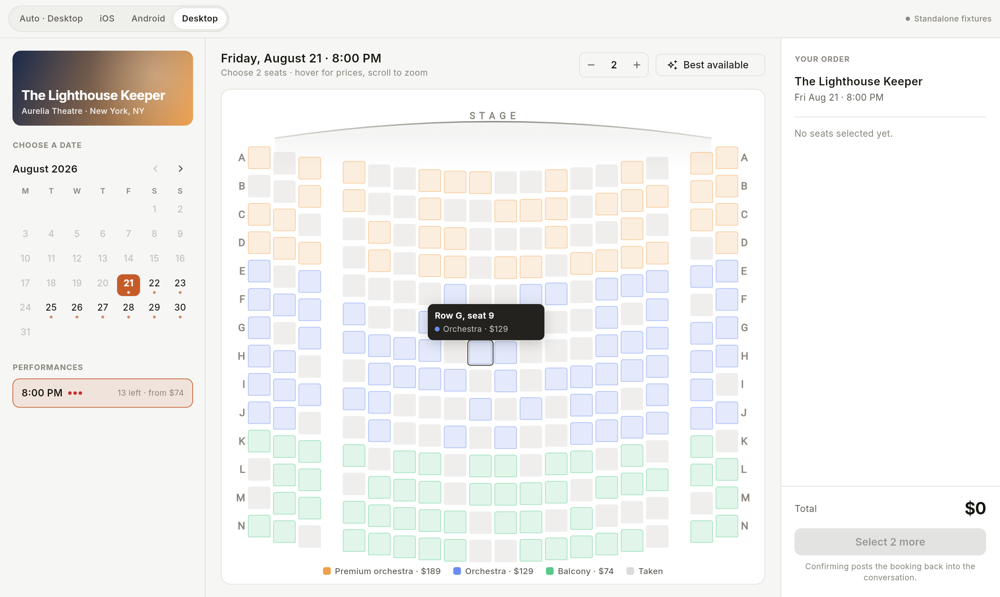
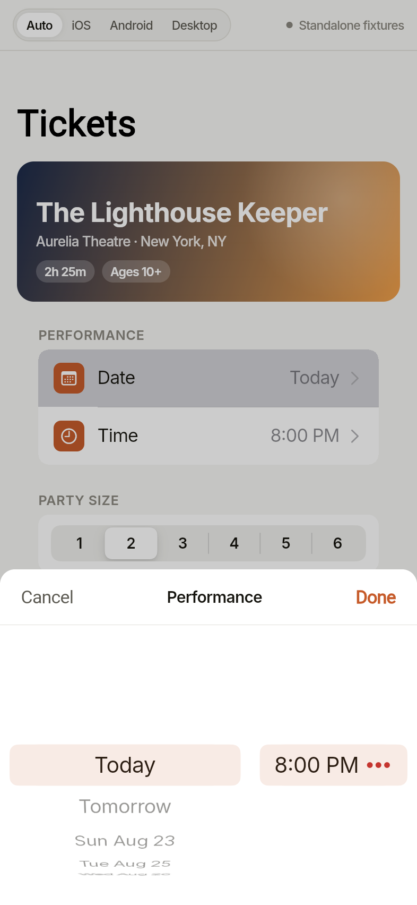
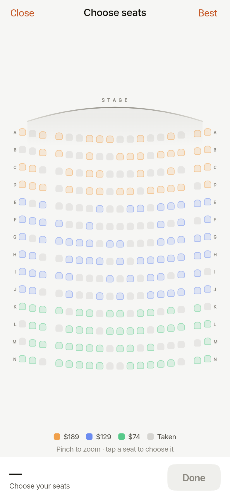
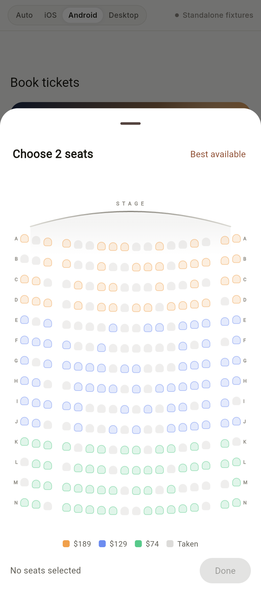
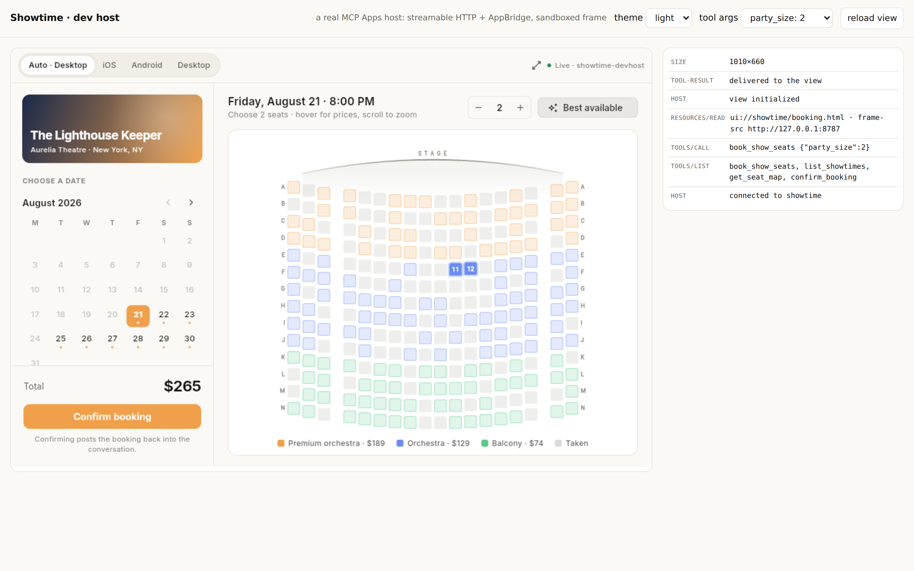

# Showtime — an MCP App in Flutter web

Pick a date, a performance, and your seats, inside the conversation.

One Flutter web build, three faces. On an iPhone the date picker is a real
`CupertinoPicker` wheel in a popup surface and the seat map is a full-screen
sheet. On a Pixel it is the Material 3 date dialog with the dark days greyed out
and a drag-handled bottom sheet. On a laptop there are no sheets or wheels at
all — a month grid, a times column, the full house at full size with hover
tooltips, and a running order rail.

<p align="center">
  
</p>

<p align="center">
  
  
  
</p>

Nothing native is involved. Flutter draws Cupertino and Material itself and
picks between them from `defaultTargetPlatform`, which Flutter web fills in from
the browser — so the same `main.dart.js` is a UIKit app on iOS, a Material app
on Android, and a pointer-first desktop app on a laptop. There is a
**Preview as** switcher in the corner so you can see all three without three
devices on the desk.

## What it demonstrates

That an interactive view can target a *protocol* rather than a platform and
still feel native on each one. The protocol is the MCP Apps extension
([SEP-1865]), which Claude, ChatGPT, VS Code and Goose all render; the platform
feel is Flutter's, decided at runtime from whatever browser it lands in.

Concretely:

- **The view calls tools, the model does not book.** `confirm_booking` is
  `visibility: ["app"]` — only the UI can call it. The model opens the picker;
  the user's click is what commits.
- **The loop closes back into the chat.** On confirm, the view sends
  `ui/update-model-context` (the durable record) and `ui/message` (a short turn),
  so the conversation continues with the booking in hand.
- **The host's theme is adopted, not imitated.** The view reads the host's CSS
  custom properties out of `hostContext.styles` and maps them onto Flutter
  colours, including `oklch()`, so it sits inside the conversation rather than
  on top of it.
- **It degrades in both directions.** A host with no MCP Apps support gets the
  tool's text result. Opened as a plain web page with no host at all, the same
  build runs on local fixtures.

<p align="center">
  
</p>

## The interesting problem: WebAssembly under the view CSP

Flutter web renders through CanvasKit, which is WebAssembly — and since 3.29
there is no other renderer. MCP App views run under a host-built CSP whose
`script-src` is `'self' 'unsafe-inline'` plus whatever origins the server
declares. Whether it also carries `'wasm-unsafe-eval'` is the host's choice, and
there is no field to ask for it ([ext-apps#605]). Where it is absent, a Flutter
build dropped into the view frame is a blank canvas.

There is a way around that, because **CSP is per-document and a cross-origin
child does not inherit its parent's.** Only local-scheme children (`srcdoc`,
`blob:`, `about:blank`) inherit one; a real `https://` child gets its policy
from its own response headers. So Flutter can instead run in a nested frame
served from our own Worker origin, talking to the shell over postMessage.

Both routes are contingent on the host: one needs `wasm-unsafe-eval` in
`script-src`, the other needs the host to honour `frameDomains` in `frame-src`.
Neither is guaranteed, and choosing at build time means guessing. **So the shell
asks.** It compiles the 8-byte empty module — magic plus version, a synchronous
throw when CSP refuses — and mounts accordingly:

```
ui://showtime/booking.html          the MCP Apps App class, inlined;
│                                   no script-src origins needed to boot
├─ wasm compiles here? ─yes─>  <script src=…/app/flutter_bootstrap.js>
│                              Flutter in this document. One frame.
└──────────────────────  no─>  <iframe src=…/app/>
                               our origin, our headers, wasm fine
```

The two paths present the same `showtimeBridge` surface to the Dart side; they
differ only in whether the calls cross a postMessage boundary. The server
declares one origin — ours — for every directive either path needs:
`resourceDomains` for the loader, `baseUriDomains` for the `<base>` it resolves
against, `connectDomains` for CanvasKit and the asset bundle, `frameDomains` for
the fallback.

The shell inlines its own script so the resource needs no `script-src` origins
to boot — which makes its size a design constraint rather than a detail. Built
on the SDK's `App` class it came to **393 kB of inline HTML**, ~99% of it zod
validating a protocol the view uses maybe eight methods of. `view/protocol.ts`
is that protocol written out as plain JSON-RPC over `postMessage`, and the
resource is now **10 kB**. The dev host still drives the view with the official
`AppBridge`, so the handshake is checked against the reference implementation on
every run.

If neither mount has painted after 12s, the shell replaces itself with the environment
report — what was refused, and the offending policy straight out of
`securitypolicyviolation.originalPolicy` — and posts it into the conversation as
a `ui/message`. A blank panel is the one outcome worth engineering away, because
it says nothing about why.

The nested path also has to survive sandbox flags, which *do* inherit: it runs
`allow-scripts` **without** `allow-same-origin`, so it is an opaque origin.
Three consequences, all handled:

- Its fetches for `canvaskit.wasm` and the fonts go out as `Origin: null`, so
  those assets need `Access-Control-Allow-Origin: *` and
  `Cross-Origin-Resource-Policy: cross-origin`.
- If the host frame sets `Cross-Origin-Embedder-Policy: require-corp`, a nested
  **cross-origin frame must send COEP itself** — CORP covers subresources, not
  documents. Without it the browser refuses the frame with
  `ERR_BLOCKED_BY_RESPONSE`, which shows up as *"This content is blocked."*
- `history.replaceState` throws `SecurityError` in an opaque origin and Flutter's
  default URL strategy calls it on boot, so `main()` does `setUrlStrategy(null)`.

Both headers come from `server/public/_headers`, not from the Worker: Cloudflare
serves a matched asset *before* the Worker runs, so Worker code never sees those
requests. The dev server mirrors those headers, and the dev host builds and
enforces the view CSP from the server's own declaration instead of running the
view unpoliced — `/devhost/?wasm=off` drops `wasm-unsafe-eval` to exercise the
fallback. Every bug in this section stayed invisible for as long as the local
harness was more permissive than production.

## Run it locally

```bash
cd server
npm install
npm run build:all          # flutter build web + bundle the view bridge
npm run dev                # http://localhost:8787
```

Three things to open:

| URL | What it is |
| --- | --- |
| `/app/` | the app as a plain web page, on local fixtures |
| `/devhost/` | a **real** MCP Apps host: streamable HTTP + `AppBridge`, sandboxed frame, and a transcript pane showing every message the model would see |
| `/mcp` | the MCP endpoint itself |

`/app/` takes `?persona=ios\|android\|desktop` to force a face and `?chrome=off`
to hide the switcher.

The dev host is worth a minute. It is not a mock — it drives the view with the
official `@modelcontextprotocol/ext-apps` host bridge inside
`sandbox="allow-scripts allow-forms"`, the same restrictions a production host
applies. If the view works there, it works because it is spec-correct.

Requires the Flutter SDK on `PATH` (or `FLUTTER=/path/to/flutter`) and Node 22+.

## Deploy

One Worker serves both halves: `/mcp` and `/app/**`. They share an origin on
purpose — that is what makes the inner frame's asset fetches same-origin.

**From GitHub Actions** (no local toolchain needed). Add two repository secrets
under Settings → Secrets and variables → Actions:

| Secret | Where it comes from |
| --- | --- |
| `CLOUDFLARE_API_TOKEN` | Cloudflare dashboard → My Profile → API Tokens → Create Token → **Edit Cloudflare Workers** template |
| `CLOUDFLARE_ACCOUNT_ID` | any Cloudflare dashboard URL, or `wrangler whoami` |

Then run **Deploy Showtime** from the Actions tab. It builds the Flutter view,
runs both test suites, deploys, and prints your URL in the job summary.

The token stays in GitHub — nothing in this repo reads it outside the workflow.

**Or locally**, if you have Flutter and Node:

```bash
cd server
npx wrangler login
npm run deploy
```

### Then use it

The interactive view renders in **Claude chat** (web and desktop), which is what
supports MCP Apps. Settings → Connectors → **Add custom connector** →
`https://showtime-mcp.<your-subdomain>.workers.dev/mcp`. Ask *"what's on at the
Aurelia this weekend?"* and the picker opens inline.

This repo is also a plugin marketplace, which is the tidier way to install it in
**Claude Code**:

```
/plugin marketplace add vpm238/flutter-mcp-app-demo
/plugin install showtime@flutter-mcp-app-demo
```

It asks for your `/mcp` URL at install and bundles a `book-a-show` skill that
tells Claude when to open the picker and — more usefully — when not to ask about
dates in chat first. Note that Claude Code gets the *tools* this way; the
`ui://` view itself renders in the hosts that implement MCP Apps.

To see the mobile faces without any of this, open `/app/` on your phone once the
Worker is up — the standalone build runs on local fixtures.

## Layout

```
.
├── app/                    the Flutter web view
│   ├── lib/src/
│   │   ├── model.dart          shapes that travel over the wire
│   │   ├── data/catalog.dart   deterministic mirror of the server's box office
│   │   ├── data/data_source.dart  MCP-backed or local fixtures, one interface
│   │   ├── mcp/                the bridge, behind a conditional import so the
│   │   │                       logic stays testable on the Dart VM
│   │   ├── booking_controller.dart  all state; the personas are presentation
│   │   ├── theme.dart          personas, palettes, host-theme adoption
│   │   └── ui/                 seat_map + ios_shell / android_shell / desktop_shell
│   └── web/index.html      the nested-frame document + its half of the relay
├── server/
│   ├── src/mcp.mjs         the MCP server: 5 tools, 1 ui:// resource
│   ├── src/domain.mjs      the box office (authoritative)
│   ├── src/worker.mjs      Cloudflare entry: /mcp + static assets
│   ├── src/dev-server.mjs  the same routes on plain Node
│   ├── view/bridge.ts      the shell: both mounts, and the choice between them
│   ├── view/protocol.ts    the MCP Apps view protocol, hand-rolled
│   ├── view/probe.ts       the environment report, when neither mount paints
│   └── devhost/            a real MCP Apps host for development
└── plugin/                 the Claude Code plugin + book-a-show skill
```

## Tests

```bash
cd server && npm test      # 28 protocol + domain tests
cd app    && flutter test  # 19 widget, controller and parity tests
```

The seat map for a performance is generated, not stored — a `mulberry32` stream
seeded from the slot id. `catalog.dart` reimplements that in Dart with an
explicit 32-bit multiply, because Dart-on-web backs `int` with a double and a
plain multiply loses precision where JavaScript's `Math.imul` does not. Both
sides assert against one fixture, so a rule that changes on one side and not the
other fails a build:

```bash
cd server && npm run fixture   # regenerate after changing domain.mjs
```

The widget tests cover the things that are easy to break and hard to notice:
that the Cupertino tree still has a real `DefaultTextStyle` (without one Flutter
paints its yellow missing-style underline), that the wheel sheet stays a sheet,
and that no persona overflows its layout.

## Known limits

- Holds live in a module-level `Map`, so they are per-isolate and best-effort.
  A real box office wants KV or a Durable Object.
- The shows, the venue, and the money are fictional.
- Inter stands in for SF Pro: CanvasKit rasterises its own text and cannot
  borrow the host OS UI font.

[SEP-1865]: https://github.com/modelcontextprotocol/ext-apps/blob/main/specification/2026-01-26/apps.mdx
[ext-apps#605]: https://github.com/modelcontextprotocol/ext-apps/issues/605
