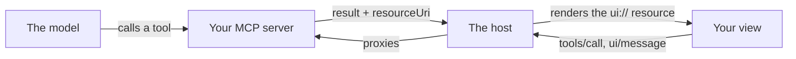

# Building an MCP App with Flutter web

How to put a real, interactive, framework-heavy UI inside a chat conversation —
and the eleven things that will go wrong, most of which fail silently.

This is written from building [Showtime](./README.md): a seat picker that runs
as an MCP App in Claude, drawn by Flutter web, rendering as Cupertino on iPhone,
Material 3 on Android, and a pointer-first layout on a laptop. Every problem
below is one that actually happened, with the fix that worked.

If you are building a plain HTML/React view, sections 1–3 and 5 still apply —
the caching, sizing, one-shot and debugging problems are not Flutter's.

---

## 1. What an MCP App is

An MCP server normally returns text. [MCP Apps][SEP-1865] adds one thing: a tool
can also point at an HTML **resource**, and the host renders it in a sandboxed
iframe next to the conversation. The view talks back over `postMessage`.

Three pieces:



The interesting property is the bottom arrow: **the view can call your tools
directly**, without the model in the loop. That is what makes it an app rather
than a rendered result. Showtime uses it so the model opens the picker but the
user's click is what books — `confirm_booking` is `visibility: ["app"]`, so the
model cannot call it at all.

---

## 2. The server half

You need a tool with `_meta.ui.resourceUri`, and a resource with the MCP App
mime type. That is genuinely all:

```js
// tools/list
{
  name: "book_show_seats",
  inputSchema: { type: "object", properties: { /* … */ } },
  _meta: {
    ui: { resourceUri: "ui://showtime/booking-v2.html", visibility: ["model"] },
  },
}

// resources/list  →  and resources/read returns { text: "<!DOCTYPE html>…" }
{
  uri: "ui://showtime/booking-v2.html",
  mimeType: "text/html;profile=mcp-app",
  _meta: {
    ui: {
      csp: {
        resourceDomains: ["https://your.origin"],   // script-src, img-src, font-src…
        connectDomains:  ["https://your.origin"],   // connect-src
        frameDomains:    ["https://your.origin"],   // frame-src
        baseUriDomains:  ["https://your.origin"],   // base-uri
      },
    },
  },
}
```

You do **not** need the MCP SDK for this. Showtime's server is stateless
JSON-RPC over one POST — a few hundred lines, no dependencies — which is also
what lets it run unchanged on Cloudflare Workers, where the SDK's Node
transports do not.

**Visibility is the design tool.** `["model"]` is a tool the model calls,
`["app"]` is one only the view can call, `["model","app"]` is both. Put the
irreversible action behind `["app"]` and the user's click becomes the thing that
commits it.

---

## 3. The view half

The view speaks JSON-RPC 2.0 over `postMessage` to `window.parent`. The whole
protocol you need is about eight methods:

```
view → host   ui/initialize                    request, once
view → host   ui/notifications/initialized     notification, once
host → view   ui/notifications/tool-result     ONE-SHOT, right after
host → view   ui/notifications/host-context-changed
view → host   tools/call                       request
view → host   ui/message                       request  (post a turn)
view → host   ui/update-model-context          request  (durable record)
view → host   ui/request-display-mode          request  (fullscreen)
view → host   ui/notifications/size-changed    notification
```

`@modelcontextprotocol/ext-apps` gives you an `App` class for this, and it is
good. **Use it while you are learning; measure it before you ship** — see
pitfall 3.

```js
const result = await app.connect(new PostMessageTransport(window.parent, window.parent));
```

Note both arguments are `window.parent`. The second is the *event source* filter;
passing `window` there means you ignore every message the host sends.

---

## 4. Why Flutter is the interesting case

Flutter web renders through CanvasKit, which is WebAssembly, and since 3.29
there is no other renderer — the HTML renderer is gone. So a Flutter view lives
or dies on whether the host's CSP allows WebAssembly, and there is no field in
the spec to ask for it ([ext-apps#605]).

The obvious workaround is to nest a second iframe served from your own origin:
CSP is per-document and a cross-origin child does not inherit its parent's, so
WebAssembly compiles normally in there.

**Do not start there.** That workaround cost more than the problem. Which brings
us to the actual content of this tutorial.

---

## 5. The eleven things that will bite you

### 1. Test the capability; don't assume it

The whole two-frame design rested on "a view CSP never allows WebAssembly."
Nobody had checked. Claude's does:

```
script-src 'self' 'unsafe-inline' 'unsafe-eval' blob: data: https://your.origin
```

`'unsafe-eval'` covers WebAssembly compilation. The nesting was never needed, and
the nested frame was the *only* part that ever failed.

Testing it costs eight bytes and one synchronous throw:

```js
function wasmAllowed() {
  try {
    // The empty module: magic + version.
    new WebAssembly.Module(new Uint8Array([0, 97, 115, 109, 1, 0, 0, 0]));
    return true;
  } catch { return false; }
}
```

Branch on that. Mount in the view document where it passes, nest a frame where
it does not, and you work in both kinds of host without guessing which you are in.

### 2. `frameDomains` and `baseUriDomains` may be ignored

The spec lets you declare four CSP domain lists. A host is not obliged to honour
them, and Claude honours two:

| Declared | Claude's actual directive | Honoured? |
| --- | --- | --- |
| `resourceDomains` | `script-src … https://your.origin` | yes |
| `connectDomains` | `connect-src 'self' https://your.origin` | yes |
| `frameDomains` | `frame-src 'self' blob: data:` | **no** |
| `baseUriDomains` | `base-uri 'self'` | **no** |

So: **a nested iframe on your own origin can never load there**, and no response
header changes that. I spent several deploys on COEP and CORP before the probe
told me the block was `frame-src`. Declare all four, depend on none.

### 3. Your resource is inline HTML; its size is a design constraint

The shell inlines its own script so the resource needs no `script-src` origins in
order to boot. That is the right call — and it means every dependency you import
becomes bytes in an HTML string the host has to accept and parse.

Built on the SDK's `App` class, Showtime's resource was **393 kB**, roughly 99% of
it zod validating a protocol the view uses eight methods of. Written out by hand
as plain JSON-RPC: **11 kB.**

```js
// The entire transport, minus error handling:
window.addEventListener("message", (event) => {
  if (event.source !== window.parent) return;
  const data = event.data;
  if (!data || data.jsonrpc !== "2.0") return;
  if (data.id !== undefined && ("result" in data || "error" in data)) settle(data);
  else if (data.method === "ui/notifications/tool-result") ontoolresult(data.params);
  // …and answer every request that carries an id, even ones you ignore.
});
```

Validation is what you give up. The safe way to give it up is to keep testing
against the official `AppBridge` in your dev host — the reference implementation
checks your handshake on every run, which is stronger than schema validation
against yourself. Add a test that fails if the resource grows back.

### 4. Flutter resolves assets against `document.baseURI` — which isn't yours

Your view runs on the host's sandbox origin (`…claudemcpcontent.com`), so
`main.dart.js`, `canvaskit/` and `assets/` resolve to *their* origin and 404.

The obvious fix is `<base href="https://your.origin/app/">`, and `base-uri 'self'`
refuses it. Configure the loader instead:

```js
const config = {
  entrypointBaseUrl: APP_URL,
  canvasKitBaseUrl: `${APP_URL}canvaskit/`,
  assetBase: APP_URL,
};

// flutter_bootstrap.js calls load() with no arguments, so load flutter.js
// first and decorate its loader in between. No string surgery on generated code.
const loader = document.createElement("script");
loader.src = `${APP_URL}flutter.js`;
loader.addEventListener("load", () => {
  const load = window._flutter.loader.load;
  window._flutter.loader.load = (opts = {}) =>
    load.call(window._flutter.loader, { ...opts, config: { ...config, ...opts.config } });
  const boot = document.createElement("script");
  boot.src = `${APP_URL}flutter_bootstrap.js`;   // sets buildConfig, calls our wrapper
  document.body.appendChild(boot);
});
document.body.appendChild(loader);
```

Build with `--no-web-resources-cdn` so CanvasKit comes from your origin rather
than gstatic, which `resourceDomains` would otherwise have to cover.

### 5. Hosts cache the resource they registered

This one cost the most. A host reads your resources when the connector is added
and **serves what it read** — Claude rendered a build several deploys old, and the
in-view probe reported findings from code that no longer existed. Every
conclusion I drew from the outside during that window was unsafe.

Two defences:

- **Stamp the build.** Put a content hash of your bundle in the resource, print
  it in the loading placeholder, and include it in every diagnostic. "Is this the
  build I deployed" should be answerable at a glance, never inferred.
- **Version the URI.** `ui://…/booking-v2.html` is a new cache key, and keep
  answering `resources/read` for the old URI with current HTML so a stale
  registration recovers instead of 404ing.

### 6. `tool-result` is one-shot and races your handshake

`toolinput`, `toolresult`, `toolcancelled` are sent **once**, immediately after
`ui/initialize`. Register handlers *before* connecting. A host that sends them
before your handshake completes drops them on the floor.

This hid for the entire life of my dev host, because the app falls back to
fetching its own data when no initial result arrives — so the booking flow worked
and the protocol bug stayed invisible until the diagnostics panel, which has no
fallback, did nothing at all.

If you write a host: wait for the bridge's `initialized` event, not `connect()`,
which resolves when the transport attaches.

### 7. A refused iframe still fires `load`

If the host blocks your nested frame, the browser renders *its own error page*
in that frame — and reports it as a successful load. Both my shell and my probe
treated that as "the frame works", which is most of why this took so long to read.

The only trustworthy signal is a message from the app inside:

```js
window.addEventListener("message", (e) => {
  if (e.source === frame.contentWindow && e.data?.channel === "mine") reallyLoaded();
});
```

### 8. `hostContext` knows the device; the user agent does not

Flutter web derives `defaultTargetPlatform` from the user agent. In a browser
that is right. **Inside a chat client's webview the UA describes the webview**,
not the phone around it — so a view opened on an iPhone can render your desktop
layout, which for an adaptive UI is the one unforgivable bug.

The protocol already carries the answer, in `hostContext`:

```
platform            'web' | 'desktop' | 'mobile'
userAgent           the host app's own identifier
deviceCapabilities  { touch, hover }
safeAreaInsets      { top, right, bottom, left }
locale, timeZone
```

Ask, then fall back to sniffing:

```dart
Persona personaFor(HostContext? host) {
  if (host == null) return detectPersona();          // no host: browser answer
  final named = _appleOrAndroid('${host.hostUserAgent} ${host.navigatorUserAgent}');
  return switch (host.hostPlatform) {
    'mobile' => named ?? Persona.ios,                 // never desktop on a phone
    'desktop' || 'web' => host.touch == true && host.hover == false
        ? (named ?? Persona.ios)
        : Persona.desktop,
    _ => named ?? detectPersona(),
  };
}
```

### 9. A size request is advisory — clamp it to what you were offered

`ui/notifications/size-changed` asks. A chat client will not grow a conversation
slot without limit, and `hostContext.containerDimensions` already told you the
cap. Asking for 660 when the host has 420 does not get you 660; it gets you 420
with the bottom sliced off.

```dart
final wanted = layout == Fit.roomy ? 660.0 : 780.0;
final cap = hostContext.maxHeight;
host.setSize(width, cap == null ? wanted : math.min(wanted, cap));
```

And separate two questions you probably conflated:

- **Persona** — which design language to speak (Cupertino / Material / desktop).
- **Fit** — how much room there is to speak it in.

A desktop browser can hand your view a 700×420 slot. A two-column layout needs
roughly 820×560 before it becomes a scrollbar, so below that a desktop persona
should get the single-column layout — still Material, still pointer-first, but it
fits.

### 10. Host colours arrive as `light-dark()`, and a naive parser eats them

A host that ships one stylesheet for both themes sends every token as
`light-dark(<light>, <dark>)`. Claude sends its entire palette that way.

A parser that reaches for the first `(` finds `light-dark`'s own, splits the
inner text on commas, and gets `rgba(255` as an argument. It returns null, the
caller falls back, and the view renders **its own defaults on the host's
background** — with no error anywhere. Split on top-level commas and pick a side:

```dart
if (fn == 'light-dark') {
  final parts = _splitTopLevel(inner);      // commas not inside nested parens
  if (parts.length != 2) return null;
  return parseCssColor(parts[dark ? 1 : 0], dark: dark);
}
```

### 11. A modal is positioned against the frame, not against what's visible

The one that looks most like magic. On a phone the seat picker simply did not
appear — laid out correctly, entirely invisible.

A sheet or dialog is positioned against the Flutter viewport, which inside a
host is the iframe. The iframe can be taller than the part of it the user can
see. A bottom sheet then lands below the visible panel, and the app looks
broken with nothing in the logs.

Compounding it: Claude sends **no `containerDimensions` at all** — `maxHeight`
is null — so you cannot clamp your way out.

The fix is the protocol, not arithmetic. `hostContext.availableDisplayModes`
includes `fullscreen`, so take the screen before opening anything big:

```dart
Future<void> makeRoom() async {
  if (fit == Fit.compact) await requestRoom?.call();   // ui/request-display-mode
}
```

Two details that matter. **Wait a frame** after the host grants it — the frame
resizes, MediaQuery changes, and a sheet opened in the same frame is still laid
out against the old size. And **time the request out** (~1s): a host that
advertises fullscreen and never answers would otherwise hold the sheet closed
until the request expires. Waiting is an optimisation; opening is the job.

---

## 6. How to debug a view you cannot see

There is no console and no network tab inside a host's sandbox, and the error
page names no cause. Three techniques, in the order they pay off:

**Put the probe inside the resource the host already renders.** Not a second
`ui://` resource — a host only knows the resources it registered, and a tool
pointing at a URI it never learned about renders *nothing*, silently, with no
error on either side. Trigger it from a distinctive tool result instead.

**Listen for `securitypolicyviolation`.** It carries `violatedDirective` and
`originalPolicy` — the entire policy string, from the host itself. This is the
single most valuable line of code in this whole document:

```js
document.addEventListener("securitypolicyviolation", (e) => {
  report(`BLOCKED: ${e.violatedDirective}\nblocked: ${e.blockedURI}\n\n${e.originalPolicy}`);
});
```

**Report out of the sandbox by two routes.** A rendered panel is only readable by
whoever is looking at the screen — the model cannot see it, and neither can
anyone you ask for help. Send findings as `ui/message` so they land in the
transcript, *and* ping your own origin (`connect-src` allows it) so a request
arriving is proof the code that made it ran:

```js
fetch(`${ORIGIN}/beacon?stage=shell-booted&build=${BUILD}`).catch(() => {});
```

An empty beacon log is a real answer: your code never ran, and the problem is
upstream of every line you have been staring at.

---

## 7. Build a harness that lies less than production does

Nearly every bug above was invisible locally because my dev host was more
permissive than the real one. Each time, the fix was to make the harness
stricter, and each time it caught the next bug for free.

A dev host worth having:

- **Drives the view with the official `AppBridge`** over real Streamable HTTP —
  not a mock, so spec-correctness is what makes it work.
- **Sandboxes it the same way**: `sandbox="allow-scripts"` with no
  `allow-same-origin`. Sandbox flags inherit; an opaque origin makes your own
  fetches cross-origin with `Origin: null`, and `history.replaceState` throws
  (Flutter's default URL strategy calls it on boot — use `setUrlStrategy(null)`).
- **Builds and enforces the CSP from your own declaration**, injected as a
  `<meta http-equiv>` into the srcdoc. Add a switch that replays the real host's
  policy verbatim once you have measured it, and one that drops
  `wasm-unsafe-eval` so both mounts stay reachable.
- **Caps the panel** and logs asked-vs-granted size. Mine resized the frame to
  whatever the view requested, which flattered the layout and hid the only sizing
  bug that mattered.
- **Mirrors production response headers** in your dev server. Missing CORS and
  COEP on assets both reached production precisely because dev was kinder.

One more, specific to Cloudflare: **static assets are served before your Worker
runs**, so Worker code never sees those requests and cannot set their headers.
They go in `public/_headers`, and the only test that catches a missing one is a
test that reads that file.

---

## 8. Checklist

Before you ship a view:

- [ ] Handlers for one-shot events registered **before** `connect()`
- [ ] `PostMessageTransport(window.parent, window.parent)` — both arguments
- [ ] Resource size measured, not assumed
- [ ] Build hash visible in the resource and in every diagnostic
- [ ] Resource URI versioned; the previous URI still answered
- [ ] All four CSP domain lists declared; none depended on
- [ ] Capability probed at runtime, with a fallback and a legible failure
- [ ] `securitypolicyviolation` listener wired
- [ ] Size requests clamped to `containerDimensions`
- [ ] Layout chosen by available space, not by platform
- [ ] Device read from `hostContext`, with the user agent as fallback
- [ ] Assets carry `Access-Control-Allow-Origin` and `Cross-Origin-Resource-Policy`
- [ ] Modals request fullscreen first on a compact panel, with a timeout
- [ ] Host colours parsed including `light-dark()`
- [ ] Dev host enforces a CSP, caps the panel, mirrors production headers, and
      sends host colours in the same syntax the real host uses

The through-line, if there is one: **every assumption I made about the host was
wrong, and every one of them was cheap to measure.** The eight-byte WebAssembly
module, the `securitypolicyviolation` listener, and the beacon each took minutes
to write and each replaced a day of guessing.

[SEP-1865]: https://github.com/modelcontextprotocol/ext-apps/blob/main/specification/2026-01-26/apps.mdx
[ext-apps#605]: https://github.com/modelcontextprotocol/ext-apps/issues/605
